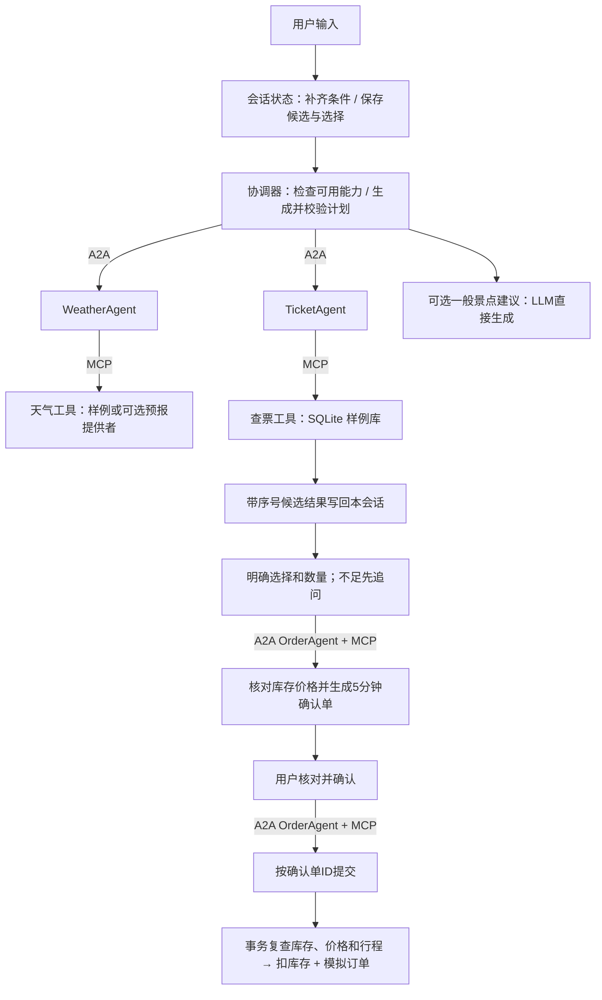

# 行知 TripWeave · 多轮对话与多 Agent 旅行助手

围绕“查天气 → 查票 → 选择候选 → 补充数量 → 核对确认单 → 模拟预订”构建可观察的多 Agent 应用。协调器维护会话状态和任务计划，3 个领域 Agent 通过真实 A2A / MCP 协议处理业务。

票务为自建虚构样例，不提供真实余票、支付或出票。默认规则模型无需 API Key；真实 LLM 需要自己的配置。本版已移除文档 RAG、项目说明问答和引用展示，景点建议仍是一般 LLM 生成，不是检索或联网搜索。

## 快速运行

需要 Python 3.12。在仓库根目录执行：

```powershell
git clone https://github.com/Mysarff/agent.git
cd agent
python -m venv .venv
.venv/Scripts/python -m pip install -r requirements.txt
.venv/Scripts/python -m TripWeave.services.stack
```

Linux/macOS 将 `.venv/Scripts/python` 换成 `.venv/bin/python`。浏览器打开 `http://127.0.0.1:8501`。启动器启动页面、3 个 A2A Agent、1 个 MCP 服务。结束时按 Ctrl+C。端口冲突会明确报错，不会杀掉其他程序。

默认“真实协议演示（规则模型）”下，请逐句输入：

1. `北京2026-10-01的天气`
2. `查同一天去上海的火车票`
3. `订第二个`
4. 在系统追问数量后输入 `1张`
5. 核对显示的车次、票号、席别、日期、数量和金额，再点击“确认模拟操作”。

第二步应显示 DEMO-TRAIN-001 / DEMO-TRAIN-002 两条虚构车票；第三步不能直接下单，第四步才生成确认单。此示例日期对应固定样例数据，不是实时信息。

也支持一句组合需求：`查询北京2026-10-01的天气和北京到上海2026-10-01的火车票，预订第二个，1张`。天气与查票可并发，预订准备依赖查票结果。

## 角色与调用流程



当前是 **3 个独立领域 Agent、4 类能力、4 个 MCP 工具**。能力为天气、查票、模拟预订、景点建议；MCP 工具为 `query_weather`、`query_tickets`、`prepare_simulated_booking`、`book_simulated_ticket`。协调器在应用进程中运行，调用 A2A client 分配任务；不额外部署为第四个 A2A Agent。

## 四项改进如何实现

### 1. 跨轮日期和城市

- 每个 `Engine` 实例持有独立 `SessionState`，Streamlit 每个会话独立创建，CLI 每次运行独立创建。
- `Turn` 描述当前输入明确提供的意图、日期、城市、票种、票号、序号和数量。规则模式使用有限解析器；LLM 模式用结构化输出提取，再由 Pydantic 和程序校验。
- Python 合并新字段，未重述的字段保留。查票的出发地优先使用已保存出发地；没有出发地时可继承此前天气城市。因此“北京的天气”之后“同一天去上海”可补齐条件。
- ISO 日期、月日、今天/明天/后天由程序解释；相对日期按 Asia/Shanghai。缺字段先追问，后续仅回复日期或城市等信息可继续同一查询。
- 模型不能猜票号、序号或数量：这些字段必须在当前输入中有可解析依据。程序补全后的查询才交给领域 Agent。
- 聊天历史仍以最近8条消息辅助规划，但日期、候选和所选票号不依赖从长聊天文本反复猜测。

### 2. 保存候选和选择

- Agent 在 A2A Task 元数据中返回结构化业务数据；页面显示编号列表，协调器校验票字段后保存同一顺序。SQL 使用 `ORDER BY price,id` 保持稳定。
- “第二个”绑定最近一次列表中的第二条，不能从模型输出虚构票号。“刚才那张”在候选有多条且未选定时会追问，不擅自选择第一条。
- 新查票会清空旧列表；查询失败、无结果或切换日期/行程条件后不继续使用旧候选。候选超过10分钟也必须重新查询。
- 输入明确票号时允许直接进入预检，但工具仍须检查票是否存在、库存是否足够。

### 3. 缺参数先追问，再确认

- 保存待补的请求类型。`订第二个` 记录选票，但数量为空时仅追问；回复 `1张` 接续该预订。
- 数量范围1至5，序号范围1至20且不得超过实际列表。“第二张”是序号，不是购买2张。
- 参数齐全后，订单 Agent 调用 `prepare_simulated_booking`。数据库生成包含票号、行程、单价、数量、总价、到期时间的报价记录。只有报价校验通过才给确认按钮。
- 每条新消息都会撤销旧的会话确认令牌；修改数量要重新预检、重新展示确认单。切换到天气等新话题会结束未完成订票。取消或清空会话不能继续确认旧操作。
- 点击确认时不再调用模型重新选票或改数量，只提交用户刚才看到的确认单 ID。

### 4. 提交时复查库存与价格

- 准备确认单时只检查，不锁库存、不创建订单。报价在 SQLite `booking_quotes` 表中保存5分钟。
- 提交时执行 `BEGIN IMMEDIATE`，在同一事务中重新读取报价和当前票务。不存在、过期、库存不足、价格/车次/席别/日期/城市变化都会拒绝，并要求重新查询确认。
- 检查成功才扣减库存、写入模拟订单并标记确认单已使用；任一写入失败整体回滚。
- 同一报价单即使用不同请求 ID 重复提交也返回已有订单，不重复扣库存；同一请求 ID 用于不同报价单会拒绝。新的报价单视作新的业务意图，并不跨不同报价自动去重。
- 确认单不是座位保留，查询时有票不保证确认时还有票。超时未收到响应也不等于一定没有创建订单；当前没有订单查询页面，需核对模拟数据库。

## 相比课程原版

原版已有 LLM 意图识别、3 个领域 Agent、A2A 与真实 MCP；本项目不把这些都声称为从零新增。

| 环节 | 原版 | 当前改进 |
| --- | --- | --- |
| 路由 | LLM 意图 + 固定分支 | 可信 AgentCard 可用性检查、BM25 能力候选、结构化计划及依赖校验 |
| 多轮 | 主要传递聊天文本 | 每会话保存出行槽位、候选列表、选票及待补参数 |
| 任务执行 | 逐个按意图调用 | 独立读取最多2路并发，依赖传递、超时和失败阻断 |
| 工具 | 天气/查票接收模型生成SQL | MCP 工具 Schema、允许列表、参数化查询；确认提交不再让模型改参数 |
| 预订 | 返回预订成功文字 | 缺参数追问、报价确认、提交复查、事务扣库存、模拟订单持久化 |
| 文档问答 | 没有当前文档链路 | 已移除上一版的小型文档 RAG；不再作为项目功能或简历卖点 |
| 运行 | 课程配置及独立启动 | 环境变量配置、一键启动、网页/CLI、自动化测试和GitHub CI |

BM25 当前仅检索能力描述和示例，帮助路由选择；这不等于文档 RAG。

## 配置模型及运行模式

将 `.env.example` 复制为 `.env`，填写自己的配置，不提交密钥：

```dotenv
TRIPWEAVE_MODEL_MODE=llm
TRIPWEAVE_API_KEY=自己的密钥
TRIPWEAVE_MODEL=服务商支持的模型名
TRIPWEAVE_BASE_URL=对应兼容接口地址
```

先停止旧服务，再执行 `python -m TripWeave.services.stack --live`。启动器和 CLI 都读取根目录 `.env`，已设置环境变量优先。调用自己的模型服务可能产生费用。

| 模式 | 模型 | 协议与数据 |
| --- | --- | --- |
| 离线演示 | 有限规则 | 不经网络协议；每会话临时SQLite样例库，关闭后不保留离线订单 |
| 真实协议演示 | 有限规则 | 真实本机A2A/MCP，持久化到 `TripWeave/var/travel.sqlite3` |
| LLM多Agent协作 | 用户配置的LLM | 同一套A2A/MCP与样例业务；外部模型效果尚未实测 |

规则语法支持北京/上海/广州/深圳、ISO日期/月日/今天明天后天、中文一至十或数字序号、1至5张等明确表达；并非任意自然语言。复杂省略表达或多段行程不能保证处理，本会话只维护一组当前出行条件。即使使用LLM，写操作也须通过程序约束。

天气默认固定样例，设置 `TRIPWEAVE_WEATHER_PROVIDER=open_meteo` 可使用已实现的外部预报适配，但外网效果未验证。`TRIPWEAVE_DB` 可指定数据库。`TRIPWEAVE_WEATHER_URL`、`TRIPWEAVE_TICKETS_URL`、`TRIPWEAVE_ORDER_URL`、`TRIPWEAVE_MCP_URL` 可指定可信服务地址。

命令行：`python -m TripWeave.main --demo` 离线体验。真实协议先在一个终端启动 `python -m TripWeave.services.stack --no-ui`，另一个终端运行 `python -m TripWeave.main --network`；真实模型则分别使用 `stack --live --no-ui` 与 `main --live`。`/confirm` 确认，`/cancel` 取消，`/quit` 退出。

## 验证与学习顺序

执行 `python -m TripWeave.verify`，报告写入 `reports/intelligence_verification.json`。测试涵盖跨轮补参、选票、歧义、候选过期、报价确认、价格库存变化、并发重放、回滚、会话隔离、真实本机协议和页面交互。报告不是外部LLM效果或生产性能评测。远端结果见 [GitHub Actions](https://github.com/Mysarff/agent/actions)。

建议依次阅读：

1. [session.py](TripWeave/intelligence/session.py)：当前输入如何转成槽位，候选和追问如何保存。
2. [router.py](TripWeave/intelligence/router.py)、[registry.py](TripWeave/intelligence/registry.py)：能力发现、候选检索和计划校验。
3. [engine.py](TripWeave/intelligence/engine.py)：任务执行、预检、确认令牌与提交。
4. [transport.py](TripWeave/intelligence/transport.py)、[domain_agent.py](TripWeave/services/domain_agent.py)：A2A业务数据、MCP发现和工具调用。
5. [mcp_tools.py](TripWeave/services/mcp_tools.py)、[data.py](TripWeave/services/data.py)：4个业务工具、报价与订单事务。
6. [test_session_booking.py](TripWeave/tests/test_session_booking.py)、[test_network.py](TripWeave/tests/test_network.py)：可复现用例及行为边界。

## 升级与部署边界

更新代码后需停止旧栈再重启：订单 MCP 参数与 A2A 业务消息已经更新，不能混用新旧进程。首次运行自动添加报价表及第二条火车票样例，已有订单和库存不删除、不重置；没有修改课程 MySQL。升级前已有订单的展示内容保持原样。

会话槽位、选票与按钮令牌保存在应用内存，清空会话或重启后不恢复；网络模式的订单与报价保存在 SQLite。各会话的选择隔离，同一实例的样例库存共享。未实现账户权限、支付、真实出票或长期记忆。

私有演示服务器：在 `.env` 设置至少12字符 `TRIPWEAVE_ACCESS_PASSWORD`，执行 `docker compose up -d --build`，默认仅映射宿主 `127.0.0.1:8501`。可通过SSH隧道访问；域名访问需另配HTTPS/WebSocket反向代理。不要公开A2A/MCP内部端口：程序端确认是应用流程控制，不是业务服务完整的身份授权系统。

Docker引擎构建尚未验证，未部署公网服务。A2A 使用 `python-a2a==0.5.4` 的 `tasks/send` 形式，不宣称兼容所有协议版本；MCP 使用 `mcp==1.18.0` Streamable HTTP。

基于 SmartVoyage 课程旅行场景二次开发。本地课程代码保留作对照，不包含在本仓库发布包中。GitHub不包含私人配置、数据库、日志或虚拟环境。
