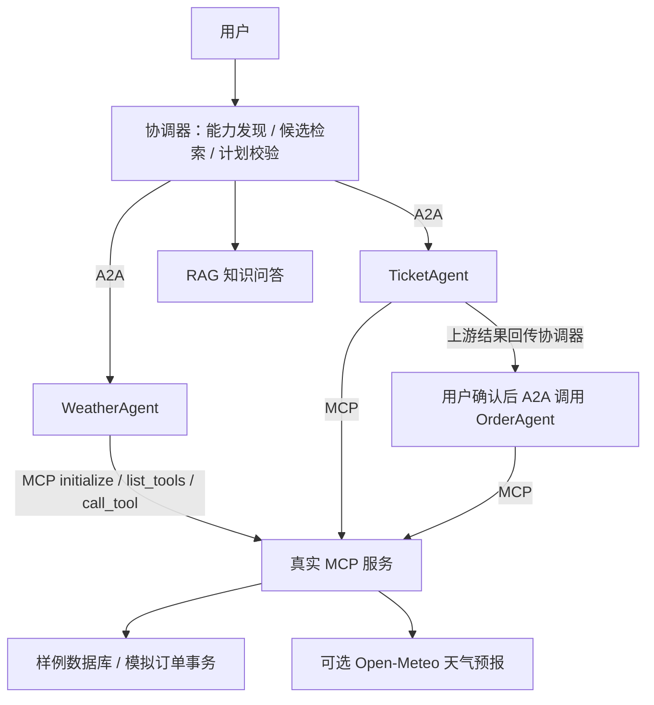

# SmartVoyage · 多 Agent 协作旅行助手

天气、票务与预订分别由领域 Agent 处理。协调器选择能力并安排任务，领域 Agent 通过真实 MCP 客户端发现和调用工具；预订在用户确认后创建本地模拟订单。

**真实网络协议、明确的数据来源。** 票务为自建演示数据，不提供实时余票、真实出票或支付。默认采用规则模型，LLM 模式需要配置自己的模型服务。

## 三分钟运行

需要 Python 3.12。在仓库根目录运行：

```powershell
python -m venv .venv
.venv/Scripts/python -m pip install -r requirements.txt
.venv/Scripts/python -m SmartVoyage.services.stack
```

Linux/macOS 使用 `.venv/bin/python` 执行上述安装与启动命令。

浏览器打开 `http://127.0.0.1:8501`。一条命令启动页面、3 个 A2A Agent 和 1 个 MCP 服务，Ctrl+C 关闭本次启动的服务。

默认选择“真实协议演示（规则模型）”，输入：

> 查询北京2026-10-01的天气，以及北京到上海2026-10-01的火车票，帮我模拟预订1张

天气与票务分别执行，票务结果传给预订任务；点击确认后保存模拟订单。展开“查看任务与执行记录”，可见 AgentCard 发现结果、所选路由、依赖、A2A 任务和 MCP 工具调用。

## 主调用链



## 配置真实 LLM

本地 Python 进程从环境变量读取配置；不会自动加载 `.env` 或原课程 `config.py`。

| 变量 | 用途 |
| --- | --- |
| `SMARTVOYAGE_API_KEY` | 自己的模型密钥，不提交 GitHub |
| `SMARTVOYAGE_MODEL` | 服务商支持的模型名称 |
| `SMARTVOYAGE_BASE_URL` | 可选的兼容模型接口地址 |
| `SMARTVOYAGE_WEATHER_PROVIDER` | `sample`（默认）或 `open_meteo` |
| `SMARTVOYAGE_DB` | 可选 SQLite 路径，默认 `SmartVoyage/var/travel.sqlite3` |
| `SMARTVOYAGE_ACCESS_PASSWORD` | 私有演示访问口令；非本机监听要求至少 12 字符 |

设置模型变量后运行 `python -m SmartVoyage.services.stack --live`，页面选择“LLM 多 Agent 协作”。协调器用 LLM 拆解复合需求，领域 Agent 用 LLM 根据 MCP 实际工具 Schema 提取参数与选择工具。规则模式是可复现演示，不能当作 LLM 效果数据。

服务地址可用 `SMARTVOYAGE_WEATHER_URL`、`SMARTVOYAGE_TICKETS_URL`、`SMARTVOYAGE_ORDER_URL`、`SMARTVOYAGE_MCP_URL` 配置。默认启动器使用本机固定端口；分机部署需自行分别启动服务并配置可信地址和网络访问控制。

## 验证与学习

```bash
python -m SmartVoyage.verify
```

测试覆盖本地真实 A2A → Streamable HTTP MCP → SQLite 的多步骤协作、引用校验、服务下线、非法工具调用、人工确认、库存事务与重复请求重放。外部 LLM 质量、在线真实票务和生产负载不在本地测试结论内。

- [改动、调用链与源码阅读顺序](docs/旅行助手_改动与学习流程.md)
- [GitHub 发布与服务器部署](docs/旅行助手_发布部署.md)
- [验证结果](reports/intelligence_verification.json)

## 来源与范围

基于 SmartVoyage 课程项目的旅行场景和学习过程二次开发。当前发布包包含新增编排层、协议服务与测试，不上传旧课程凭证、SQL 初始化脚本或整个课程目录。原项目在本地保留，未删除或迁移原 MySQL 数据；本版便携演示库与其隔离。

A2A 适配使用 `python-a2a==0.5.4` 的 `tasks/send` 消息形式，不宣称兼容所有版本的 A2A 客户端。MCP 使用 `mcp==1.18.0` Streamable HTTP。能力发现仅访问配置中的可信地址，不扫描互联网或任意注册服务。

这是学习与私有演示项目：尚无独立用户账户、支付、真实出票或生产级配额管理。多访客共享同一实例的样例库存；不要存入个人出行信息。公开运营前还需身份认证、限流及独立部署验证。
